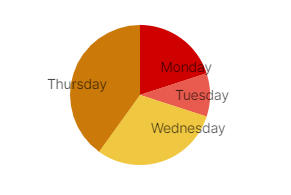

# Obsidian-Charts   

This Plugin lets you create Line and Bar Charts in [Obsidian](https://www.obsidian.md).

## Usage

To create a Chart simply create a fenced Codeblock using 'chart' as the language. Inside of it you need to specify the `labels` (X-Axis), the `series` (Y-Axis / Data) and the `type`, either bar or line, in valid YAML.

**`series` always needs to be a nested list even if you only need one!**

### Basic Examples

```yaml
    ```chart
    type: bar
    labels: [Monday, Tuesday, Wednesday, Thursday, Friday]
    series: [[12, 5, 8, 8 , 5], [5, 8, 7, 9, 12]]
    ```
```


```yaml
    ```chart
    type: line
    labels: [Monday, Tuesday, Wednesday, Thursday, Friday]
    series: [[12, 5, 8, 8 , 5], [5, 8, 7, 9, 12]]
    ```
```


The Pie Chart works a bit differently, it only accepts a **single** `series` List. But before you start using it remember that Obsidian has the option to create Pie Charts via MermaidJS without any Plugins (<https://mermaid-js.github.io/mermaid/#/pie>).

```yaml
    ```chart
    type: pie
    labels: [Monday,Tuesday,Wednesday,Thursday]
    series: [20,10,30,40]
    ```
```



### Advanced Modificators

- You can omit Data by typing for example 'null'. This will create a Gap inside the Chart (Anything that is not a Number should work).
- To cut some Area under the Chart you can add the Modifier `low: n`, while n represents the y value (works with both Line and Bar Chart)

```yaml
    ```chart
    type: line
    labels: [Monday, Tuesday, Wednesday, Thursday, Friday]
    series: [[12, 5, null, 8 , 5], [null, 8, 7, 9, 12]]
    ```
```

#### Line Charts (Advanced)


- To fill these Gaps you can add the Modifier `fillGaps: true` (Default: `false`).
- To show the Area under the Line you can add the Modifier `showArea: true` (Default: `false`).

__Full example:__

```yaml
    ```chart
    type: line
    labels: [Monday, Tuesday, Wednesday, Thursday, Friday]
    series: [[12, 6, null, null, 5], [6, 8, 7, 9, 12]]
    low: 5
    fillGaps: true
    showArea: true
    ```
```

#### Bar Charts (Advanced)

- It is also possible to use the `stacked: bool` Property if used on a Bar chart to create stacked Bars (Default: `false`).
- There is the `horzizontal: bool` Property to create horizontal Bars (Default: `false`)

## How to install

1. Go to **Community Plugins** in your [Obsidian](https://www.obsidian.md) Settings and **disable** Safe Mode
2. Click on **Browse** and search for "Obsidian Charts"
3. Click install
4. Toggle the Plugin on in the **Community Plugins** Tab


## Customizing Charts

You can edit the Stylesheet inside the Plugin folder (`.obsidian/plugins/obsidian-charts/styles.css`). The important Color Values are all located at the beginning.
## Roadmap

- [ ] Create Chart from Table
- [x] Fixed CSS
- [ ] Autoresize (Currently the Chart doesnt resize if you open or close the sidebars)
- [x] More Modificators (Area under Line, Fill Gaps, etc.)
