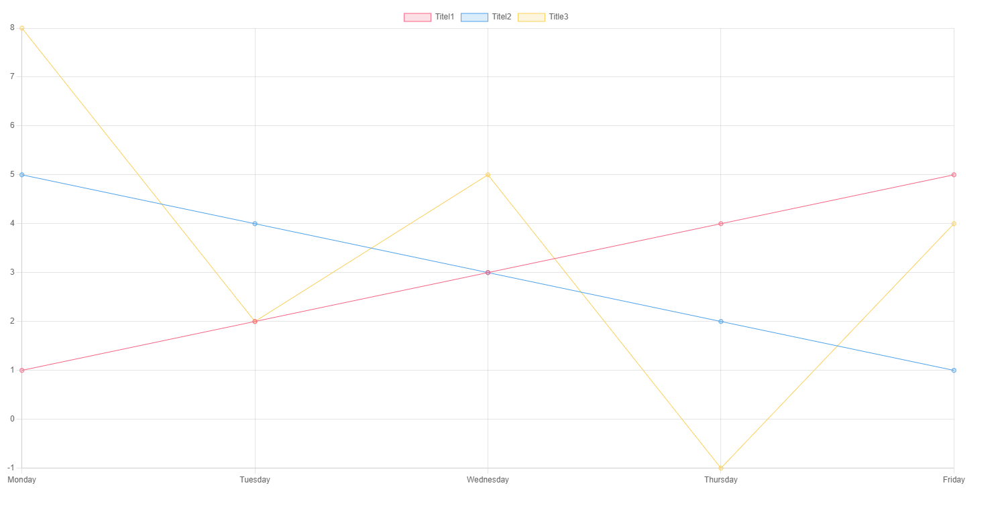
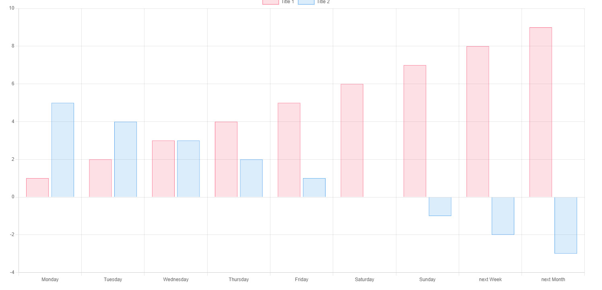
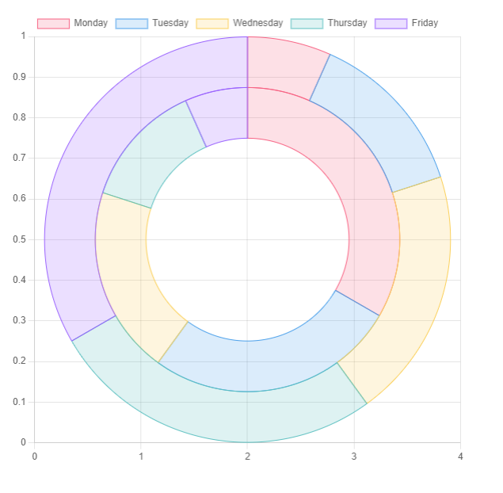
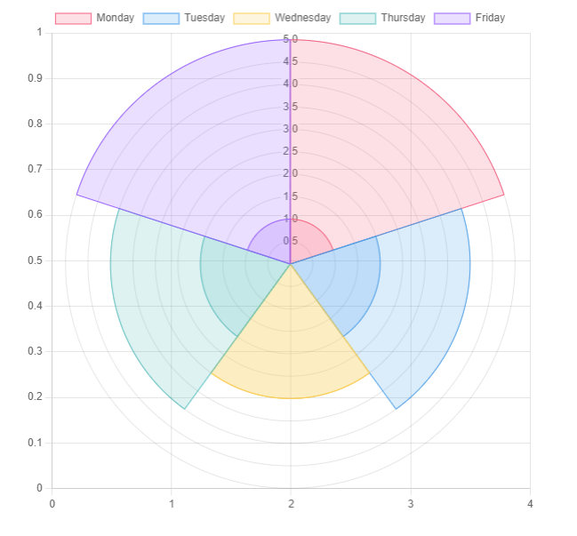

# Obsidian-Charts  

This Plugin lets you create interactive Charts in [Obsidian](https://www.obsidian.md).

## Usage

To create a Chart within Obsidian a Codeblock of the type `chart` is used. The Properties are set using YAML Syntax. Example:

```yaml
    ```chart
        type: ""
        labels: []
        series:
          - title: ""
            data: []
          - title: ""
            data: []

    ```
```

The `title` Property *can* be omitted, but it is not advised to do so.

> You might **not** be able to copy the Examples directly into Obsidian, the Indentation is probably wrong and Obsidian tries to convert pasted Text to Markdown, which escapes a few important characters.

### Legacy Mode

For anyone who has used this Plugin before the Release of v2.0.0, there is a legacy Mode so you don't need to manually convert your old Charts to the new Syntax. Just add `legacy: true` to your old Charts. **Please do not use this for new Charts, legacy Mode might get removed in future Versions.**
### Chart Types

This Plugin provides 6 different Variants. The type of a Chart is set by the `type: {Type}` Property. 

#### Line Chart

```yaml
    ```chart
        type: line
        labels: [Monday,Tuesday,Wednesday,Thursday,Friday]
        series:
          - title: Title 1
            data: [1,2,3,4,5]
          - title: Title 2
            data: [5,4,3,2,1]
          - title: Title 3
            data: [8,2,5,-1,4]
    ```
```

The above example Code will render a *Line Chart* with 3 individual traces, titled "Title 1", "Title 2" and "Title 3".



*See also: [Modifiers](#Modifiers)*

#### Bar Chart

```yaml
    ```chart
        type: bar
        labels: [Monday,Tuesday,Wednesday,Thursday,Friday, Saturday, Sunday, "next Week", "next Month"]
        series:
          - title: Title 1
            data: [1,2,3,4,5,6,7,8,9]
          - title: Title 2
            data: [5,4,3,2,1,0,-1,-2,-3]
    ```
```

The above example Code will render a *Bar Chart*.



#### Radar Chart

```yaml
    ```chart
        type: radar
        labels: [Monday,Tuesday,Wednesday,Thursday,Friday]
        series:
          - title: Title 1
            data: [1,2,3,4,5]
          - title: Title 2
            data: [5,4,3,2,1]
        width: 40%
    ```
```

The above example Code will render a *Radar Chart*, a `width` Modifier is already added, since this Chart would be way to big otherwise.


#### Doughnut and Pie Chart

```yaml
    ```chart
        type: pie
        labels: [Monday,Tuesday,Wednesday,Thursday,Friday]
        series:
          - title: Title 1
            data: [1,2,3,4,5]
          - title: Title 2
            data: [5,4,3,2,1]
        width: 40%
        labelColors: true
    ```
```

The above example Code will render a *Pie Chart*, a `width` Modifier is already added, since this Chart would be way to big otherwise. The Property `labelColors` is also set to `true`, which is the desired behaviour most of the time.


```yaml
    ```chart
        type: doughnut
        labels: [Monday,Tuesday,Wednesday,Thursday,Friday]
        series:
          - title: Title 1
            data: [1,2,3,4,5]
          - title: Title 2
            data: [5,4,3,2,1]
        width: 40%
        labelColors: true
    ```
```

The above example Code will render a *Doughnut Chart*, a `width` Modifier is already added, since this Chart would be way to big otherwise. The Property `labelColors` is also set to `true`, which is the desired behaviour most of the time.



#### Polar Area Chart

```yaml
    ```chart
    type: polarArea
    labels: [Monday,Tuesday,Wednesday,Thursday,Friday]
    series:
      - title: Title 1
        data: [1,2,3,4,5]
      - title: Title 2
        data: [5,4,3,2,1]
    labelColors: true
    width: 40%
    ```
```

The above example Code will render a *Polar Area Chart*, a `width` Modifier is already added, since this Chart would be way to big otherwise. The Property `labelColors` is also set to `true`, which is the desired behaviour most of the time.



### Modifiers

#### `width` Modifier

The `width` Modifier is used to set the width of **any** Chart. It is advised to use it for the following Charts:

- Pie Chart
- Doughnut Chart
- Radar Chart
- Polar Area Chart

The Values can be any valid CSS Property, for examples fixed Values (e.g. `400px`) or dynamic Values (e.g `40%`).

- Default: `100%`

##### Example

```yaml
    ```chart
    type: polarArea
    labels: [Monday,Tuesday,Wednesday,Thursday,Friday]
    series:
      - title: Title 1
        data: [1,2,3,4,5]
      - title: Title 2
        data: [5,4,3,2,1]
    width: 40%
    ```
```

#### `fill` Modifier

The `fill` Modifier is used in Line Charts to fill the Area under the Traces.


- Expected: `boolean` (`true` or `false`)
- Default: `false`

##### Example

```yaml
    ```chart
        type: line
        labels: [Monday,Tuesday,Wednesday,Thursday,Friday]
        series:
          - title: Title 1
            data: [1,2,3,4,5]
          - title: Title 2
            data: [5,4,3,2,1]
          - title: Title 3
            data: [8,2,5,-1,4]
        fill: true
    ```
```

#### `tension` Modifier

The `tension` Modifier is used in Line Charts to set the tension of the Traces to the given points. A Value of 0 means no smoothness at all, a value of 1 is maximum smoothness.

- Expected: Double (0-1)
- Default: 0

##### Example

```yaml
    ```chart
        type: line
        labels: [Monday,Tuesday,Wednesday,Thursday,Friday]
        series:
          - title: Title 1
            data: [1,2,3,4,5]
          - title: Title 2
            data: [5,4,3,2,1]
          - title: Title 3
            data: [8,2,5,-1,4]
        tension: 0.5
    ```
```

#### `beginAtZero` Modifier

The `beginAtZero` Modifier is used to force set the Chart to begin at 0. Otherwise the Chart will cut out all unused space.

- Expected: `boolean` (`true` or `false`)
- Default: `false`

##### Example

```yaml
    ```chart
        type: line
        labels: [Monday,Tuesday,Wednesday,Thursday,Friday]
        series:
          - title: Title 1
            data: [4,2,3,4,5]
          - title: Title 2
            data: [5,4,3,2,2]
          - title: Title 3
            data: [8,2,5,3,4]
        beginAtZero: true
    ```
```
#### `legend` Modifier
The `legend` modifier sets whether or not the legend will be displayed. 

- Expected: `boolean` (`true` or `false`)
- Default: `true`

##### Example 
```yaml
    ```chart
        type: line
        labels: [Monday,Tuesday,Wednesday,Thursday,Friday]
        series:
          - title: Title 1
            data: [4,2,3,4,5]
          - title: Title 2
            data: [5,4,3,2,2]
          - title: Title 3
            data: [8,2,5,3,4]
        legend: false
    ```
```
#### `legendPosition` Modifier
Determines where the legend will be displayed. 
- Expected `top`, `left`, `bottom`, `right`
- Default: `top`

#### Axes Modifiers
Valid for `bar` and `line` types only. 
##### `indexAxis` Modifier
Allows horizontal graphs
- Expected: `x` or `y`
- Default: `y`

##### `stacked` Modifier
Will change the bar and line graphs to be stacked. 
- Expected: `boolean` (`true` or `false`)
- Default: `false`

##### Modifiers by Axis
Prepend either the x or y axis to any of these to modify them. 
###### `Reverse` modifier 
Can reverse the axis it is applied to 
- Expected: `boolean` (`true` or `false`) 
- Default: `false`
```yaml
    ```chart
        type: line
        labels: [Monday,Tuesday,Wednesday,Thursday,Friday]
        series:
          - title: Title 1
            data: [4,2,3,4,5]
          - title: Title 2
            data: [5,4,3,2,2]
          - title: Title 3
            data: [8,2,5,3,4]
        xReverse: true
    ```
```
##### `Min` and `Max` Modifiers
Can set the min and max of the respecitve axis. `Min` will override beginAtZero. 
- Expected: `int` 

##### `Display` and `TickDisplay` Modifiers
Determines whether the axis (`Display`) or the ticks of the axis (`TickDisplay`) are visible.
- Expected: `boolean` (`true` or `false`)
- Default: `true`

## Customization

### Changing Colors

Right now the Colors cannot be changed, I am working on implementing Color Pickers for a Settings Tab, so the Colors can be customized again.

### Interactivity

**All** Charts are interactive.

- You can click the different Graphs inside the Legend to make them dissappear (and reappear)
- You can hover over the Chart to see more detailed information

## How to install

1. Go to **Community Plugins** in your [Obsidian](https://www.obsidian.md) Settings and **disable** Safe Mode
2. Click on **Browse** and search for "Obsidian Charts"
3. Click install
4. Toggle the Plugin on in the **Community Plugins** Tab

## Support me

If you find this Plugin helpful, consider supporting me:

<a href="https://www.buymeacoffee.com/phibr0"></a>
