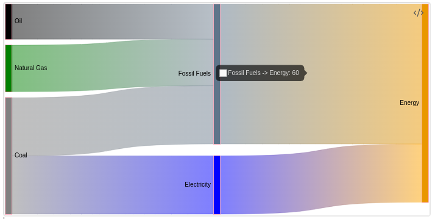

# Sankey Chart

## Example

````yaml
```chart
type: sankey
labels: [Oil, "Natural Gas", Coal, "Fossil Fuel", Electricity, Energy]
series:
  - data:
      - [Oil, 15, "Fossil Fuels"]
	  - ["Natural Gas", 20, "Fossil Fuels"]
	  - ["Coal", 25, "Fossil Fuels"]
	  - ["Coal", 25, "Electricity"]
	  - ["Fossil Fuels", 60, "Energy"]
	  - ["Electricity", 25, "Energy"]
    priority:
	  Oil: 1
	  Natural Gas: 2
	  Coal: 3
	  Fossil Fuels: 1
	  Electricity: 2
	  Energy: 1
    colorFrom:
	  Oil: "black"
	  Coal: "gray"
	  "Fossil Fuels": "slategray"
	  Electricity: "blue"
	  Energy: "orange"
    colorTo:
	  Oil: "black"
	  Coal: "gray"
	  "Fossil Fuels": "slategray"
	  Electricity: "blue"
	  Energy: "orange"
```
````

The above example Code will render a _Sankey Chart_.



## Advanced

*See [Modifiers](/Modifiers) for advanced configuration.*